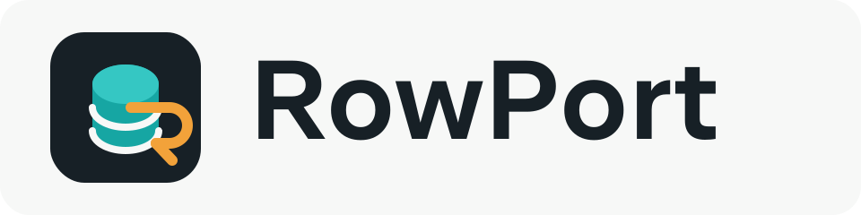

<p align="center">
  
</p>

# RowPort

[](https://github.com/gloopai/rowport/actions/workflows/ci.yml)
[](LICENSE)

[中文说明](README.zh-CN.md)

RowPort is a fast, restrained desktop MySQL client built with Wails, Go, and Vue. It focuses on the everyday database workflow: connecting to servers, browsing schemas, editing table rows, importing and exporting data, and running SQL without leaving a compact native app.

The goal is a modern desktop experience in the spirit of tools like DataGrip, while keeping the app small, native, and easy to reason about.

## Why RowPort?

- Native desktop shell with a focused Vue interface.
- Practical MySQL workflows: table browsing, row editing, SQL execution, CSV import, and CSV/JSON export.
- Multiple saved server profiles with optional SSH tunneling.
- Remembered database and SSH secrets are stored in macOS Keychain, not in local storage.
- Dark desktop UI designed for repeated database work, not a browser-style admin panel.

## Features

- Connect to MySQL with host, port, user, password, and an optional default database.
- Save and switch between multiple server profiles.
- Connect through an SSH tunnel with password auth, private key text, or a private key path, with host key verification (known_hosts plus per-profile trust-on-first-use).
- Encrypt MySQL connections with SSL/TLS (preferred, required, verify-ca, verify-identity) and optional CA, client certificate, and server name.
- Store remembered MySQL passwords, SSH passwords, and SSH key passphrases in macOS Keychain.
- Browse databases, tables, columns, indexes, primary keys, and table DDL.
- Open tables with pagination, filtering, ordering, CSV import, CSV/JSON export, and visible-row copy.
- Insert, edit, and delete rows for tables with primary keys.
- Run SQL against the selected database and inspect result sets in a scrollable grid.
- Keep multiple result tabs open and inspect row details.
- Export application logs for debugging and issue reports.
- Configure connection pool settings per profile.
- Open `.sql` files and generate common SELECT, INSERT, UPDATE, DELETE, and DDL templates.

## Status

RowPort is early preview / pre-release software, but already usable. The core connection, schema browsing, table data, row mutation, SQL console, query cancellation, profile management, SSH tunnel, MySQL SSL/TLS, SSH host key verification, import/export, and log workflows are implemented.

Packaging, release automation, cross-platform credential storage, an interactive SSH fingerprint confirmation dialog, and richer result tools are still planned.

## Platform Support

| Platform | Current status | Notes |
| --- | --- | --- |
| macOS | Primary development target | Keychain-backed secrets are implemented. |
| Windows | Planned | App can be built with Wails, but credential persistence and release packaging still need work. |
| Linux | Planned | App can be built with Wails, but Secret Service support and release packaging still need work. |

## Download

Prebuilt GitHub Releases are planned for the first public version. For now, run RowPort from source with the development or build commands below.

## Tech Stack

- Wails v2 for the desktop shell and Go-to-frontend bindings.
- Go for MySQL connections, SSH tunneling, Keychain integration, and filesystem dialogs.
- Vue 3 and Vite for the frontend.
- `go-sql-driver/mysql` for database access.
- `golang.org/x/crypto/ssh` for SSH tunnel support.

## Repository Layout

```text
.
├── app.go                  # Go backend methods exposed to the frontend
├── main.go                 # Wails app entrypoint
├── frontend/               # Vue/Vite frontend
├── build/                  # Wails build assets and platform metadata
├── docs/assets/            # Project logo and brand assets
└── scripts/go-wails        # Local Wails compiler wrapper
```

## Requirements

- Go 1.24 or newer.
- Node.js 20 or newer and npm.
- Wails CLI v2.
- A reachable MySQL server for manual testing.
- macOS for Keychain-backed credential storage. Other platforms can run the app, but credential persistence needs platform-specific implementation work.

## Development

Install frontend dependencies:

```sh
cd frontend
npm ci
```

Start Wails development mode:

```sh
cd ..
GOCACHE="$PWD/.gocache" \
GOMODCACHE="$PWD/.gomodcache" \
wails dev -compiler "$PWD/scripts/go-wails"
```

## Build

The local macOS SDK used by this project needs `UniformTypeIdentifiers` linked for the current Wails version, so use the wrapper script:

```sh
GOCACHE="$PWD/.gocache" \
GOMODCACHE="$PWD/.gomodcache" \
wails build -compiler "$PWD/scripts/go-wails"
```

If Wails reports a generic compile error, this direct command verifies the production executable:

```sh
GOCACHE="$PWD/.gocache" \
GOMODCACHE="$PWD/.gomodcache" \
"$PWD/scripts/go-wails" build \
  -buildvcs=false \
  -tags desktop,wv2runtime.download,production \
  -ldflags "-w -s" \
  -o "$PWD/build/bin/rowport"
```

## Verification

Run the frontend build:

```sh
cd frontend
npm run build
```

Run Go tests:

```sh
cd ..
GOCACHE="$PWD/.gocache" \
GOMODCACHE="$PWD/.gomodcache" \
go test ./...
```

## Security Notes

- Pasted SSH private key text is treated as one-time input and is not persisted.
- Remembered MySQL passwords, SSH passwords, and SSH key passphrases are stored in macOS Keychain.
- Turning off a remember option removes that secret from Keychain when the profile is saved.
- Deleting a profile removes all remembered secrets for that profile.
- Non-secret profile fields are stored in browser local storage.

## Roadmap

- Add an interactive SSH host fingerprint confirmation dialog and known_hosts management UI.
- Add richer query history, saved snippets, and result tools.
- Add saved snippets and more result export tools.
- Add release builds for macOS and Windows.
- Add screenshots and short demo GIFs before the first public release.

## Contributing

Issues and pull requests are welcome. Start with [CONTRIBUTING.md](CONTRIBUTING.md), keep changes focused, include verification notes, and avoid persisting secrets outside the platform credential store.

See [docs/PROJECT_PLAN.zh-CN.md](docs/PROJECT_PLAN.zh-CN.md) for the current product plan and TODO list.
